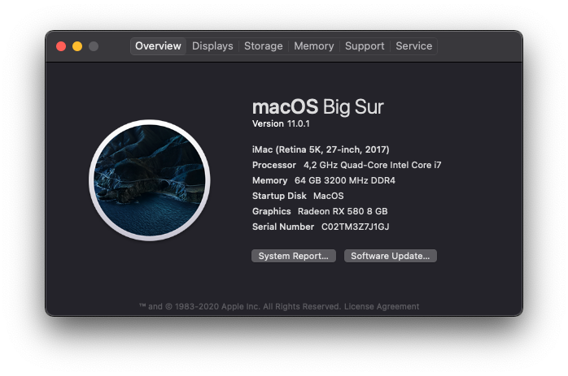

Upgrade MacOS from 10.15.6 to 11.0.1
### Function

| Name                | Specifications | Funtional or not |
| ------------------- | -----------------------------------------|---------------|
| Processor           | Intel Core i7-7700K Processor            |Fully|
| Memory              | Corsair Vengeance® RGB PRO 3200Mhz (16x4)                          |Fully|
| Storage             | Samsung SSD 970 EVO  |Fully|
| Graphics            | Radeon RX 580                   |Fully with WhateverGreen.kext|
| Display             | DELL 2518D              |Fully support HIDPI|
| Audio               | Realtek Audio ALC1220 codec               |Fully with AppleALC.kext and layout-id 11|
| Ethernet            | Intel(R) Ethernet Connection (4) I219-V  |Fully with IntelMausi.kext|
| WLAN & Bluetooth    | Wifi BCM94360CS2      |Fully|

### MSI Z270 Carbon BIOS Settings
1. Save & Exit → Restore Defaults : **Yes**
2. Advanced \ Integrated Peripherals → Network Stack : **[Disabled]**
3. Advanced \Integrated Peripherals → Intel Serial IO : **[Disabled]**
4. Advanced \ USB Configuration → XHCI Hand-off : **[Enabled]**
5. Advanced \ USB Configuration → Legacy USB Support : **[Auto]**
6. Advanced \ Windows OS Configuration → MSI Fast Boot : **[Disabled]**
7. Advanced \ Windows OS Configuration → Fast Boot : **[Disabled]**
8. Overclocking → Extreme Memory Profile(X.M.P) : **[Enabled]**
9. Overclocking \ CPU Features → Intel Virtualization Tech : **[Enabled]**
10. Overclocking \ CPU Features → Intel VT-D Tech : **[Disabled]**
11. Boot → Boot mode select : **[LEGACY+UEFI]**
##### Dedicated graphics card:
1. Advanced \ Integrated Graphics Configuration → Initiate Graphic Adapter : PEG
##### Intel iGPU:
1. Advanced \ Integrated Graphics Configuration → Initiate Graphic Adapter : IGD
2. Advanced \ Integrated Graphics Configuration → DVMT Pre-Allocated : 96M

### Hardware
* MSI Z270 Carbon
* I7700K Kabylake
* Samsung SSD 970 EVO
* Radeon RX 580
* Wifi BCM94360CS2
### Image

### Ref
* https://dortania.github.io/OpenCore-Install-Guide/
* https://github.com/corpnewt/ProperTree
* https://github.com/dortania/OpenCore-Install-Guide/tree/master/clover-conversion
* https://www.tonymacx86.com/threads/success-msi-z270-gaming-pro-carbon-intel-tm-core-r-i7-7700k-corsair-rgb-16gb-ram-amd-rx580.228994
